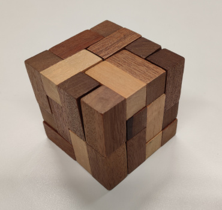

# Block puzzles

This page contains a Python script `blocks.py` for solving 2D and 3D 
block puzzles. An example of such a block puzzle is 



## Features

* Solve puzzles using the Z3 solver
* Save the puzzles in SMT format
* Draw pieces in VRML format. A WRL viewer is required to view them

Below the pieces of the half-cube puzzle are shown


## Puzzle format

A puzzle is stored in a simple textual format. Each line contains a
piece of the puzzle. A line contains the 3D coordinates of the cubes of
a piece. Hence, a line consists of triples of integer values.

The `pieces` directory contains examples of some puzzles.
The `goals` directory contains targets of the puzzles. 

## Using the script

The pieces of a puzzle can be visualized using calls like this:
```
python3 blocks.py --draw --pieces="pieces/half_cube.txt" --grid
python3 blocks.py --draw --pieces="solutions/half_cube-4x4x4.txt"
```
The option `--grid` puts the pieces in a 2 dimensional grid. This can be 
useful to avoid collisions.

A puzzle can be solved using a call like this:
```
python3 blocks.py --solve --pieces="pieces/offroad_cube.txt" --goal="goals/4x4x4.txt"
```
The input consists of a file containing the pieces of the puzzle, and a
file containing the goal of the puzzle.  The goal is a file in the same
format as the pieces. It should contain one piece only, which is the desired
configuration of the puzzle. Note that some puzzles may take a long time to
solve.

The option `--transform` can be used to compute and display all possible
orientations of the pieces. For example the call
```
python3 blocks.py --transform --pieces="pieces/hexomino_3d.txt" --goal="goals/4x4x4.txt"
```
results in the output
```
Saving 144 piece orientations to file 'hexomino_3d-0.wrl'
Saving 432 piece orientations to file 'hexomino_3d-1.wrl'
Saving 432 piece orientations to file 'hexomino_3d-2.wrl'
Saving 192 piece orientations to file 'hexomino_3d-3.wrl'
Saving 432 piece orientations to file 'hexomino_3d-4.wrl'
Saving 384 piece orientations to file 'hexomino_3d-5.wrl'
Saving 144 piece orientations to file 'hexomino_3d-6.wrl'
Saving 144 piece orientations to file 'hexomino_3d-7.wrl'
Saving 288 piece orientations to file 'hexomino_3d-8.wrl'
Saving 288 piece orientations to file 'hexomino_3d-9.wrl'
Saving 324 piece orientations to file 'hexomino_3d-10.wrl'
```
These numbers give an indication of how complex the puzzle is.

The option `--smt` is used to save the puzzle in `.smt` format. For
example the call
```
python3 blocks.py --smt --pieces="pieces/offroad_cube.txt" --goal="goals/4x4x4.txt"
```
produces a file `offroad_cube-4x4x4.smt` that can be used as input for an
SMT solver.

## Acknowledgements

Thanks to Huub van de Wetering for providing the code for visualizing the
puzzles, and to Alex Uuldriks for providing the puzzle that can
be found in `pieces/hexomino_3d.txt`.

## Links to puzzles

https://diypuzzles.wordpress.com/tag/4x4x4-cube/

https://puzzlewillbeplayed.com/444/Gemini/

https://en.wikipedia.org/wiki/Tetromino

https://en.wikipedia.org/wiki/Pentomino

https://en.wikipedia.org/wiki/Hexomino

https://www.youtube.com/watch?v=Jr36wC9cbHI
