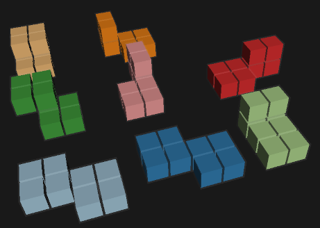
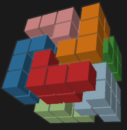

# Block puzzles

This page contains a Python script `blocks.py` for solving 2D and 3D 
block puzzles. An example of such a block puzzle is 


## Features

* Solve puzzles using the Z3 solver.
* Save puzzles in SMT format.
* Draw puzzles and solutions in VRML format. A WRL viewer is required to view them.

Below the pieces of the half-cube puzzle are shown.



## Puzzle format

A puzzle is stored in a simple textual format. Each line contains a
piece of the puzzle. A piece consists of the 3D coordinates of the cubes
of the piece. Hence, each line consists of triples of integer values.

The goal of a puzzle is stored in the same format as the puzzles. It should
contain one piece only, which is the desired configuration of the puzzle. 

The `puzzles` directory contains several examples of puzzles.
The `goals` directory contains target configurations of the puzzles.

If you have additional puzzles, please send them to [wieger@10x10.org](mailto:wieger@10x10.org),
so that I can add them to the repository. A puzzle consists of
a text file with the coordinates of the pieces, a text file with
the coordinates of the goal, a name of the puzzle, and optionally a
link to a description of the puzzle.

## Requirements

The Python package `z3-solver` must be installed, see https://pypi.org/project/z3-solver/.

## Using the script

The option `--draw` is used to create `.wrl` files that can be viewed
with a WRL viewer. The pieces of a puzzle can be drawn using a call like this:
```
python3 blocks.py --draw --pieces="puzzles/half_cube.txt" --grid
```
The option `--grid` puts the pieces in a 2 dimensional grid. This 
is done to avoid collisions.

The option `--scatter` is used to move pieces away from the center
of gravity. This can be helpful to view a solution, as demonstrated in
the picture below.



A solution of a puzzle can be drawn using a call like this:
```
python3 blocks.py --draw --pieces="solutions/half_cube-4x4x4.txt"
```

A puzzle can be solved using a call like this:
```
python3 blocks.py --solve --pieces="puzzles/offroad_cube.txt" --goal="goals/4x4x4.txt"
```
The input consists of a file containing the pieces of the puzzle, and a
file containing the goal of the puzzle. Note that some puzzles may take a long time to
solve.

The option `--transform` can be used to compute and display all possible
orientations of the pieces. For example the call
```
python3 blocks.py --transform --pieces="puzzles/hara_cube.txt" --goal="goals/4x4x4.txt"
```
results in the output
```
Saving 144 piece orientations to file 'hara_cube-0.wrl'
Saving 432 piece orientations to file 'hara_cube-1.wrl'
Saving 432 piece orientations to file 'hara_cube-2.wrl'
Saving 192 piece orientations to file 'hara_cube-3.wrl'
Saving 432 piece orientations to file 'hara_cube-4.wrl'
Saving 384 piece orientations to file 'hara_cube-5.wrl'
Saving 144 piece orientations to file 'hara_cube-6.wrl'
Saving 144 piece orientations to file 'hara_cube-7.wrl'
Saving 288 piece orientations to file 'hara_cube-8.wrl'
Saving 288 piece orientations to file 'hara_cube-9.wrl'
Saving 324 piece orientations to file 'hara_cube-10.wrl'
```
These numbers give an indication of how complex the puzzle is.

The option `--smt` is used to save the puzzle in `.smt` format. For
example the call
```
python3 blocks.py --smt --pieces="puzzles/offroad_cube.txt" --goal="goals/4x4x4.txt"
```
produces a file `offroad_cube-4x4x4.smt` that can be used as input for an
SMT solver.

## Acknowledgements

Thanks to Huub van de Wetering for providing the visualizations of the
puzzles, and thanks to Alex Uuldriks for handing me Hara's Cube
puzzle and challenging me to solve it.

## Links to puzzles

https://diypuzzles.wordpress.com/tag/4x4x4-cube/

https://puzzlewillbeplayed.com/444/Gemini/

https://en.wikipedia.org/wiki/Tetromino

https://en.wikipedia.org/wiki/Pentomino

https://en.wikipedia.org/wiki/Hexomino

https://www.youtube.com/watch?v=Jr36wC9cbHI
